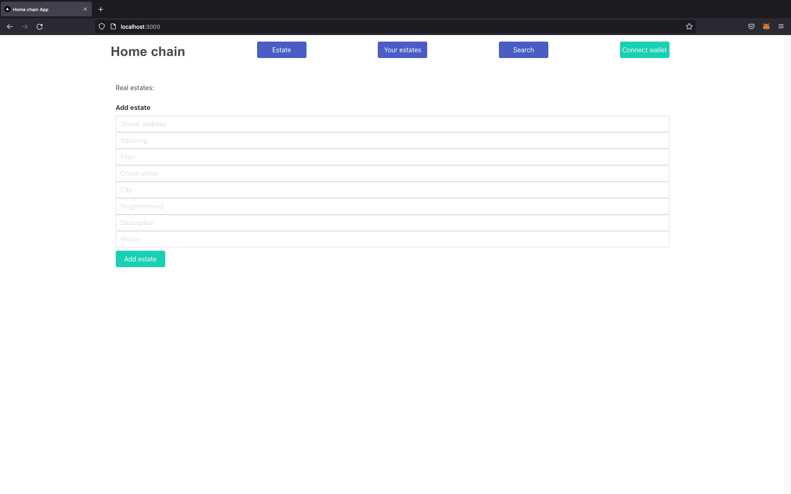
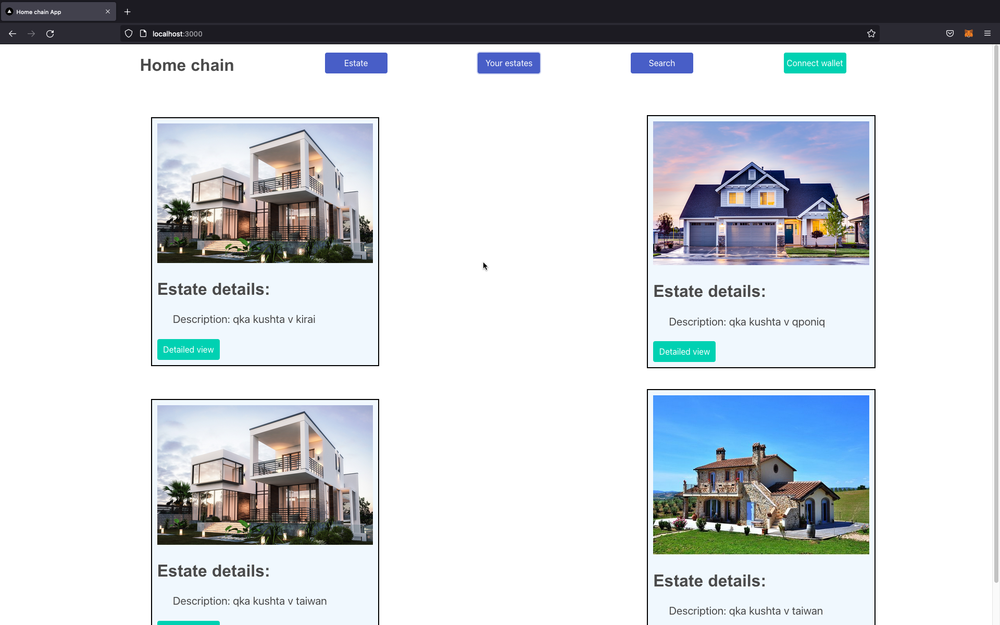
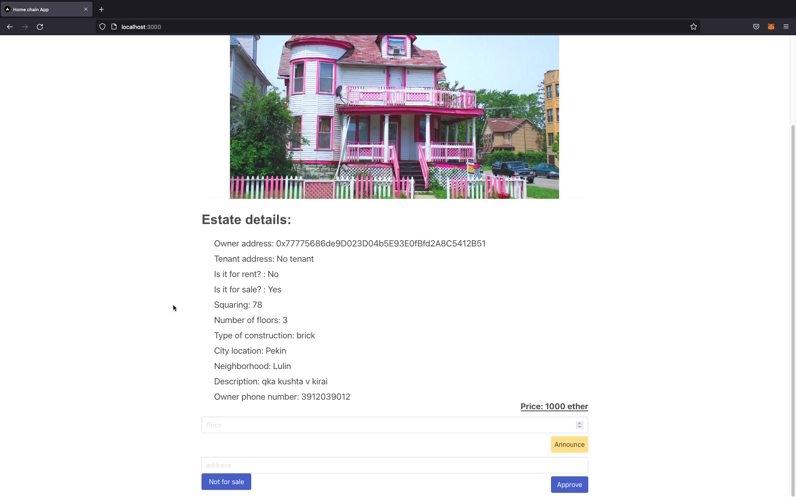
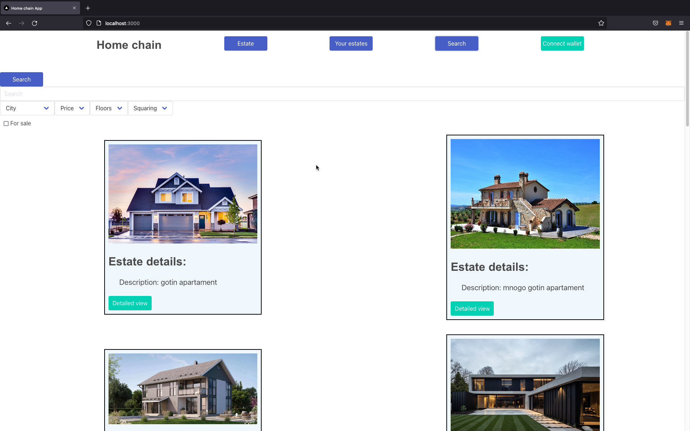
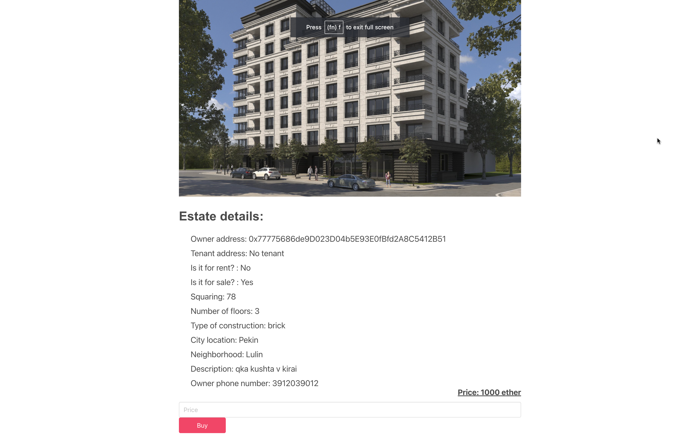

# HomeChain
### Участници
- Димитър Кюртов, 81797
- Иван-Асен Чакъров, 81837
- Стоян Николов, 81785
- Сияна Николова, 81907

# Увод

HomeChain е блокчейн проект, базиран на Ethereum, който може да бъде ползва за търгуване с имоти.

# Използвани Технологии

Бизнес логиката е имплементирана като смарт контракт,
като също е разработен и Уеб базиран потребителски
интерфейс, който си комуникира с контракта използвайки
Web3.js. Ето и списък с използваните технологии:

- Back-end (Blockchain):
  - Ethereum
  - Solidity
- Front-end:
  - React
  - Next.js
  - Web3.js

# Смарт контракт

Бизнес логиката на проекта е имплементирана под формата на Ethereum
смарт контракт, писан на Solidity.
Имаме един контракт - `HomeChain.sol`. Основното нещо с което работим е имоти. Те се представят
със следната структура:
```c#
struct RealEstate {
    address payable owner;
    address tenant;
    bool forRent;
    bool forSale;
    uint payday;
    uint256 squaring;
    uint256 floor;
    string construction;
    string city;
    string neighborhood;
    string description;
    string phone;
}
```

Идейно, за всеки имот можем да си мислим като за ERC721 токен,
тъй като всеки имот е уникален, незаменим и си има адрес притежател.

Имаме няколко "роли", които даден адрес може да притежава в HomeChain:
- `owner`: Собственик на имот
- `tenant`: Наемател на имот
- `government`: Играе ролята на "правителство". Стойността му е адреса на създателя на
   смарт контракта.

Всяка една от тези роли си има съответен `modifier`, който служи за дефиниране на позволените
действия, които този адрес може да извършва.
Нека накратко обясним какво може да прави всяка една роля.

## Адрес без никаква роля
Тези адреси могат да извършват следните неща:
- Да чете данните за различните имоти (`getEstateById`)
- Да закупи даден имот
- Да вземе даден имот под наем

## Owner
Всеки имот има собственик - `owner`, който може да прави следните неща със своя имот:
- Да променя някаква "мета" информация за него, като например `phone`
- Да обяви имота за продажба, използвайки `announceEstateForSale`
- Да обяви имота за даване под наем, използвайки `announceEstateForRent`
- Да го продаде
- Да го дава по наем
- Да изгони обитателя (`tenant`) на имота, в случай, че не си е платил наема на време.

## Government
Правителството има най-много права в HomeChain. Като цяло има всички права, които има
и собственикът на даден имот от негово име. Допълнителните операции, които може да
извършва са основно свързани с промяна на "мета" информацията на даден имот:
- да създава нови имоти, използвайки `addEstate`
- да променя квадратурата на имоти
- да променя етажа на имоти
- да променя квартала на имоти
- да променя допълнителното описание на имоти

## Tenant
Наемателите на даден имот могат да правя следните неща:
- Да напуснат имота чрез `leave`
- Да си платят наема за имота чрез `payRent`. Това прави следното:
  1. Праща `msg.value / 9` / 9 пари на правителството.
  2. Праща `msgvalue - msg.value / 9` пари на собственика.
  3. Добавя 30 дена към крайния срока за плащане на наема.

# Потребителски интерфейс

Потребителският интерфейс е реализиран като статично Уеб приложение на React.
Използва също Next.js и Web3.js. Разделен е на няколко основни екрана:
## 1. Създаване на нов имот (Estate)
Създаването на нови имоти е достъпно само за адресът, с роля на правителството:


## 2. Разглеждане на собствени имоти (Your Estates)
### 2.1. Списък от собствените имоти


### 2.2. Детайлен изглед на собствените имоти


## 3. Търсене на съществуващи имоти
### 3.1. Списък с търсене и филтрация


### 3.2. Детайлен изглед


# Бъдещо развитие

В бъдеще можем да внесем няколко подобрения и по смарт контрактите и по фронт-енда.

По смарт-контрактите можем да спестим малко от информацията, която
се пази на блокчейна, като започнем да ползваме алтернативен начин за съхранение,
например IPFS. Данните, които могат да се преместят там са тези, които не играят
никаква роля в бизнес логиката на контракта, например квадратурата или картинката,
която се показва в потребителския интерфейс.

По фронт-енда можем да изчистим много неща визуално, като също можем да добавим
по-разширено търсене и филтрация. Примерно можем да дадем възможност на потребителя
да търси само имоти, които се намират на ограничено разстояние от него.

# Начин на ползване
https://github.com/dimitarkyurtov/HomeChain - repo на проекта
Навигиране до root папката на проекта след клониране
cd .\home-chain-app\
npm i
npm run dev

адрес на контракта в Rinkeby - 0xbDEe473c80087F6E4CABa3d6387a4295385b2c9f
адрес на abi файлът - home-chain-app\blockchain\build\blockchain_contracts_HomeChain_sol_HomeChainProduction.abi
адрес на смарт контракта - home-chain-app\blockchain\contracts\HomeChain.sol

